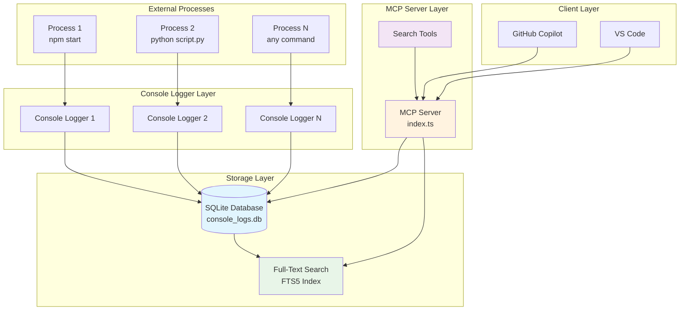
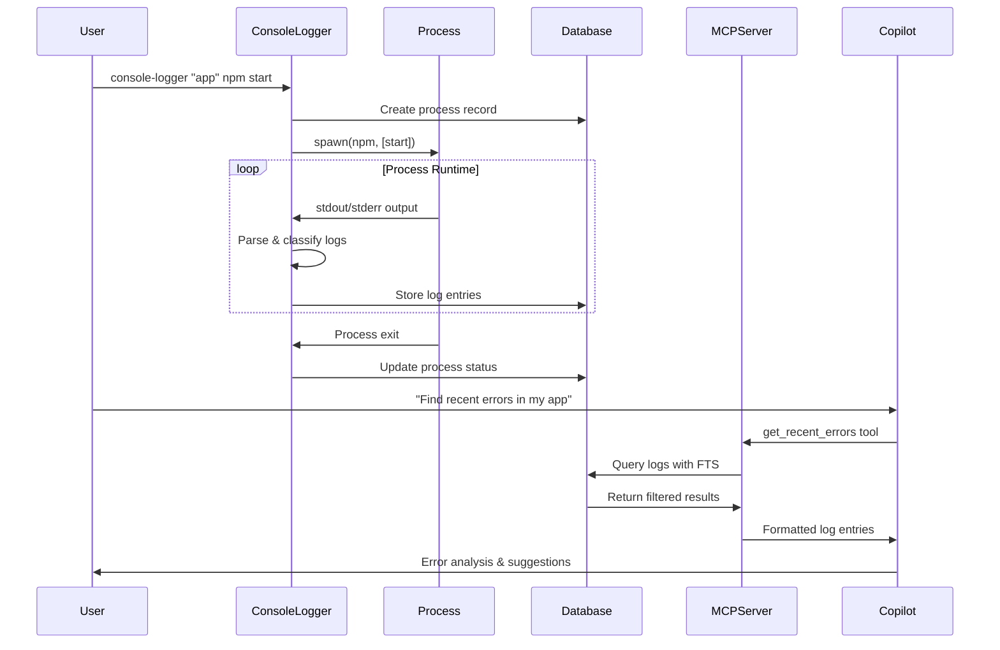
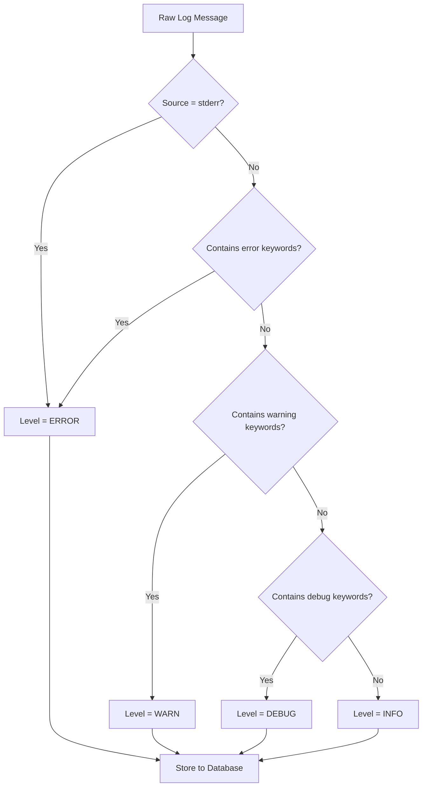
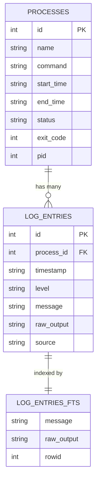
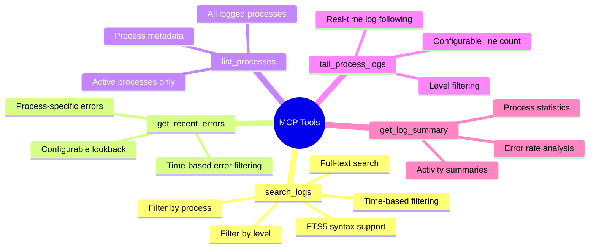
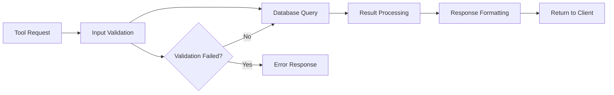
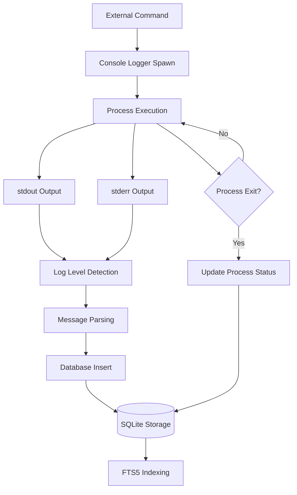
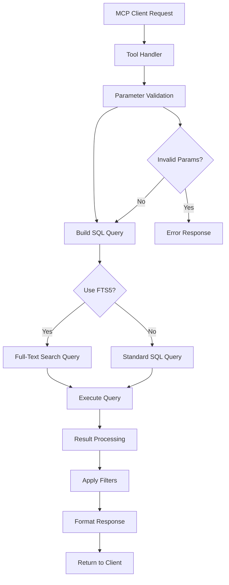
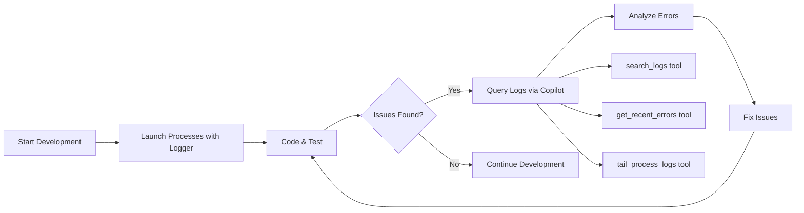

# Console MCP Design Document

## Overview

The Console MCP (Model Context Protocol) is a bridge system that connects external console processes with Copilot through structured log capture and search capabilities. This project consists of two main components:

1. **Console Logger** - A command wrapper that captures stdout/stderr from any process and stores it in a searchable database
2. **MCP Server** - Provides tools for searching, analyzing, and monitoring the captured logs through the Model Context Protocol

## Architecture

### High-Level System Architecture



### Component Interaction Flow



## Core Components

### 1. Console Logger (`src/logger.ts`)

The Console Logger is a command wrapper that intercepts and captures all output from child processes.

#### Key Features

- **Process Wrapping**: Spawns child processes and captures all stdout/stderr
- **Intelligent Log Classification**: Automatically detects log levels (error, warn, info, debug)
- **Real-time Storage**: Streams log entries to SQLite database as they occur
- **Process Lifecycle Management**: Tracks process start, end, exit codes, and status

#### Log Level Detection Algorithm



#### Usage

```bash
console-logger "my-app" npm start
console-logger "python-script" python analyze.py --verbose
console-logger "build-process" make build
```

### 2. Database Layer (`src/database.ts`)

The database layer provides structured storage and efficient querying capabilities.

#### Schema Design



#### Database Features

- **SQLite with FTS5**: Full-text search capabilities for efficient log searching
- **Optimized Indexing**: Indexes on timestamp, level, and process_id for fast queries
- **PRAGMA Optimizations**: WAL mode, synchronous=NORMAL for performance
- **Automatic Cleanup**: Built-in methods for old log cleanup and maintenance

### 3. MCP Server (`src/index.ts`)

The MCP Server exposes structured tools for log analysis through the Model Context Protocol.

#### Available Tools



#### Tool Implementation Pattern



## Data Flow

### Log Capture Flow



### Search Query Flow



## Key Design Decisions

### 1. SQLite with FTS5

- **Rationale**: Provides excellent full-text search capabilities without external dependencies
- **Benefits**: Fast text searches, simple deployment, ACID compliance
- **Trade-offs**: Single-writer limitation (acceptable for this use case)

### 2. Real-time Log Streaming

- **Rationale**: Immediate availability of logs for debugging active processes
- **Implementation**: Synchronous database writes on each log line
- **Performance**: Optimized with WAL mode and prepared statements

### 3. Automatic Log Level Detection

- **Rationale**: Reduces manual configuration while providing useful categorization
- **Algorithm**: Keyword-based detection with stderr source prioritization
- **Fallback**: Default to 'info' level when uncertain

### 4. Process-centric Organization

- **Rationale**: Natural grouping for troubleshooting and analysis
- **Benefits**: Easy process-specific filtering and lifecycle tracking
- **Implementation**: Foreign key relationship with cascade cleanup

## Performance Considerations

### Database Optimization

```sql
-- Indexing strategy for common queries
CREATE INDEX idx_log_entries_timestamp ON log_entries(timestamp);
CREATE INDEX idx_log_entries_level ON log_entries(level);
CREATE INDEX idx_log_entries_process_id ON log_entries(process_id);

-- FTS5 virtual table for full-text search
CREATE VIRTUAL TABLE log_entries_fts USING fts5(
  message, raw_output, content='log_entries', content_rowid='id'
);
```

### Memory Management

- **Streaming Processing**: Process logs line-by-line to avoid memory accumulation
- **Batch Inserts**: Group database operations for better performance
- **Connection Pooling**: Reuse database connections across operations

## Security Considerations

### Data Protection

- **Local Storage**: All logs stored locally, no external transmission
- **File Permissions**: Database files created with restricted permissions
- **Input Sanitization**: All user inputs validated and sanitized

### Process Isolation

- **Child Process Security**: Spawned processes inherit minimal environment
- **Command Validation**: Basic validation of command arguments
- **Error Handling**: Graceful handling of process failures

## Usage Patterns

### Development Workflow



### Debugging Scenarios

1. **Error Investigation**:

   ```text
   Copilot: "Find all errors in the last hour"
   → get_recent_errors(hours=1)
   ```

2. **Process Monitoring**:

   ```text
   Copilot: "Show me what my build process is doing"
   → tail_process_logs(process="build", lines=50)
   ```

3. **Pattern Analysis**:

   ```text
   Copilot: "Search for database connection issues"
   → search_logs(query="database connection", level="error")
   ```

## Future Enhancements

### Potential Improvements

- **Log Rotation**: Automatic cleanup of old logs based on age/size
- **Performance Metrics**: CPU/memory usage tracking for processes
- **Real-time Notifications**: Alert system for critical errors
- **Log Aggregation**: Merge logs from multiple sources
- **Export Capabilities**: Export logs in various formats (JSON, CSV)

### Scalability Considerations

- **Horizontal Scaling**: Multiple MCP servers for different log directories
- **Compression**: Compress old log entries to save space
- **Partitioning**: Partition large tables by time ranges
- **Caching**: Cache frequently accessed queries

## Integration Examples

### VS Code Integration

```json
{
  "mcpServers": {
    "console-mcp": {
      "command": "node",
      "args": ["/path/to/console_mcp/build/index.js"],
      "env": {
        "CONSOLE_LOG_DIR": "/path/to/logs"
      }
    }
  }
}
```

### Development Script Integration

```bash
#!/bin/bash
# start-dev.sh
console-logger "frontend" npm run dev &
console-logger "backend" python manage.py runserver &
console-logger "worker" celery worker &

echo "All processes started with logging enabled"
```

This design enables powerful debugging workflows where developers can use natural language queries through Copilot to investigate issues across multiple concurrent processes, making the development and debugging process more efficient and intuitive.
