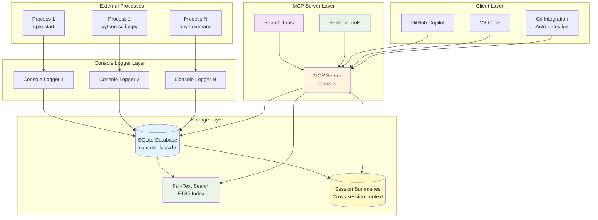
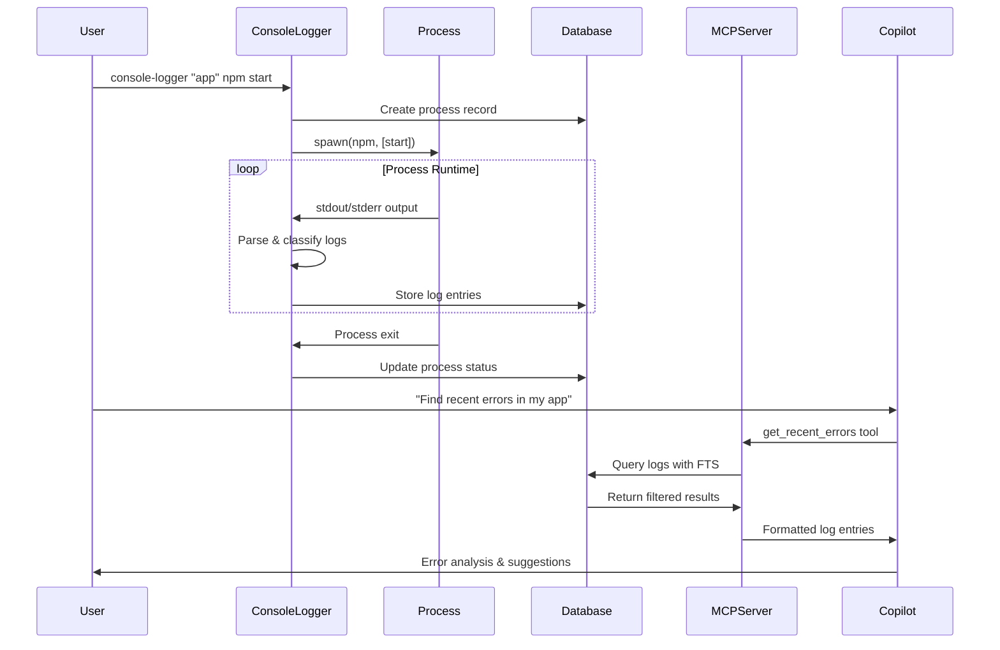
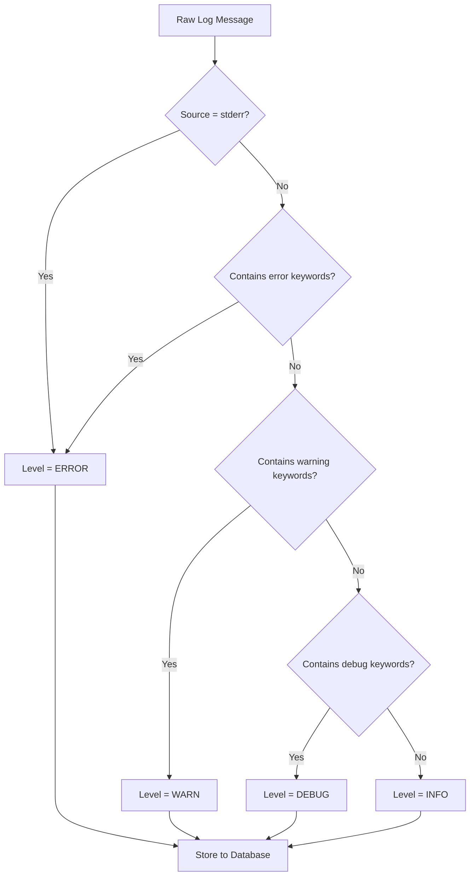
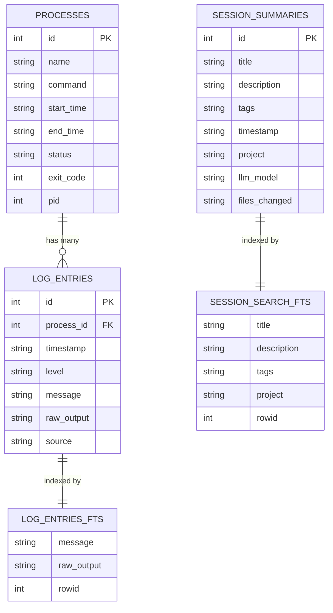
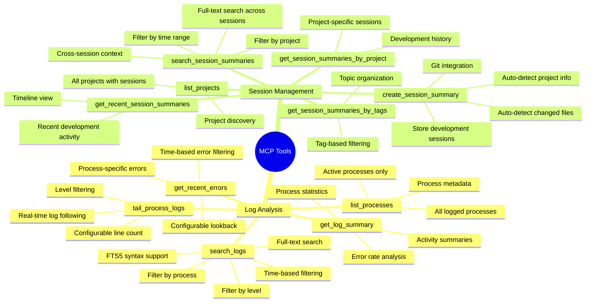
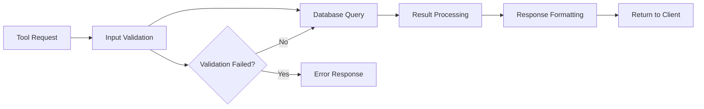
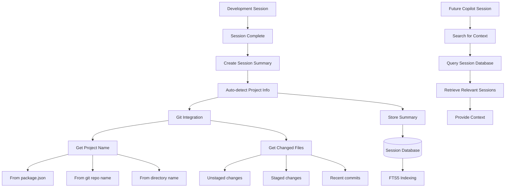
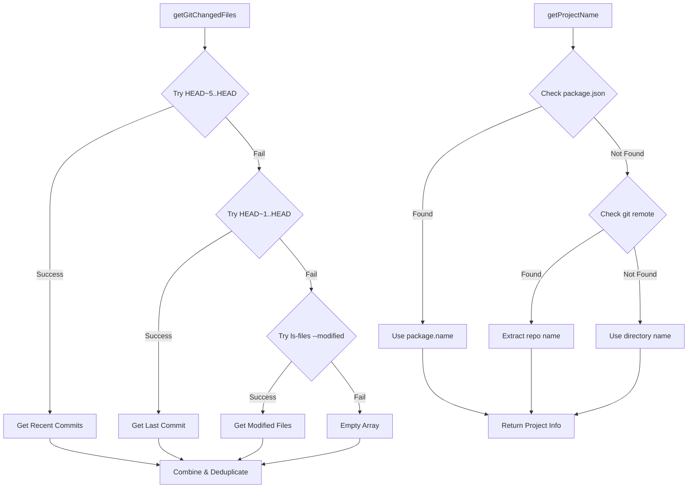

# Console MCP Design Document

## Overview

The Console MCP (Model Context Protocol) is a bridge system that connects external console processes with Copilot through structured log capture, search capabilities, and session context management. This project consists of three main components:

1. **Console Logger** - A command wrapper that captures stdout/stderr from any process and stores it in a searchable database
2. **MCP Server** - Provides tools for searching, analyzing, and monitoring the captured logs through the Model Context Protocol
3. **Session Summary System** - Captures and enables searching of development session context across different Copilot instances

## Architecture

### High-Level System Architecture



### Component Interaction Flow



## Core Components

### 1. Console Logger (`src/logger.ts`)

The Console Logger is a command wrapper that intercepts and captures all output from child processes.

#### Key Features

- **Process Wrapping**: Spawns child processes and captures all stdout/stderr
- **Intelligent Log Classification**: Automatically detects log levels (error, warn, info, debug)
- **Real-time Storage**: Streams log entries to SQLite database as they occur
- **Process Lifecycle Management**: Tracks process start, end, exit codes, and status

#### Log Level Detection Algorithm



#### Usage

```bash
console-logger "my-app" npm start
console-logger "python-script" python analyze.py --verbose
console-logger "build-process" make build
```

### 2. Database Layer (`src/database.ts`)

The database layer provides structured storage and efficient querying capabilities.

#### Schema Design



#### Database Features

- **SQLite with FTS5**: Full-text search capabilities for efficient log searching
- **Optimized Indexing**: Indexes on timestamp, level, and process_id for fast queries
- **PRAGMA Optimizations**: WAL mode, synchronous=NORMAL for performance
- **Automatic Cleanup**: Built-in methods for old log cleanup and maintenance

### 3. MCP Server (`src/index.ts`)

The MCP Server exposes structured tools for log analysis through the Model Context Protocol.

#### Available Tools



#### Tool Implementation Pattern



### 4. Session Summary System (`src/git-utils.ts`)

The Session Summary System enables persistent context sharing across different Copilot sessions and VS Code instances.

#### Session Summary Features

- **Cross-Session Context**: Store and retrieve development session summaries
- **Automatic Git Integration**: Auto-detect project names and changed files
- **Full-Text Search**: Search across session titles, descriptions, and tags
- **Project Organization**: Group sessions by project for easy navigation
- **Tag-Based Categorization**: Organize sessions with searchable tags

#### Session Summary Flow



#### Git Integration Strategy



#### Session Summary Schema

```json
{
  "id": 1,
  "title": "Implemented Authentication System",
  "description": "# Authentication Implementation\n\n## Overview\n...",
  "tags": "[\"authentication\", \"security\", \"api\"]",
  "timestamp": "2025-06-17T23:09:20.411Z",
  "project": "my-webapp",
  "llm_model": "claude-3.5-sonnet",
  "files_changed": "[\"src/auth.ts\", \"api/login.ts\", \".env.example\"]"
}
```

#### Use Cases

1. **Cross-Session Context Retrieval**:
   ```text
   Copilot: "Search for previous authentication work"
   → search_session_summaries(query="authentication")
   ```

2. **Project Development History**:
   ```text
   Copilot: "Show me all work done on this project"
   → get_session_summaries_by_project(project="my-webapp")
   ```

3. **Feature-Specific Context**:
   ```text
   Copilot: "Find sessions about bug fixes"
   → get_session_summaries_by_tags(tags=["bug-fix"])
   ```

4. **Recent Development Activity**:
   ```text
   Copilot: "What was worked on recently?"
   → get_recent_session_summaries(hours=72)
   ```

### Debugging Scenarios

1. **Error Investigation**:

   ```text
   Copilot: "Find all errors in the last hour"
   → get_recent_errors(hours=1)
   ```

2. **Process Monitoring**:

   ```text
   Copilot: "Show me what my build process is doing"
   → tail_process_logs(process="build", lines=50)
   ```

3. **Pattern Analysis**:

   ```text
   Copilot: "Search for database connection issues"
   → search_logs(query="database connection", level="error")
   ```

4. **Context-Aware Debugging**:

   ```text
   Copilot: "What authentication work was done previously?"
   → search_session_summaries(query="authentication")
   ```

5. **Project History Analysis**:

   ```text
   Copilot: "Show me all bug fixes for this project"
   → get_session_summaries_by_tags(tags=["bug-fix"])
   ```

6. **Cross-Session Problem Solving**:

   ```text
   Copilot: "Find similar database issues from past sessions"
   → search_session_summaries(query="database error solution")
   ```

### Potential Improvements

**Log Management**:
- **Log Rotation**: Automatic cleanup of old logs based on age/size
- **Performance Metrics**: CPU/memory usage tracking for processes
- **Real-time Notifications**: Alert system for critical errors
- **Log Aggregation**: Merge logs from multiple sources
- **Export Capabilities**: Export logs in various formats (JSON, CSV)

**Session Enhancement**:
- **Automatic Session Detection**: Smart detection of session boundaries
- **Visual Session Timeline**: Timeline view of development sessions
- **Session Sharing**: Export/import session summaries for team collaboration
- **AI-Powered Insights**: Automatic extraction of key insights from sessions
- **Integration with Git History**: Link sessions to specific commits/branches
- **Session Templates**: Pre-defined templates for common session types
